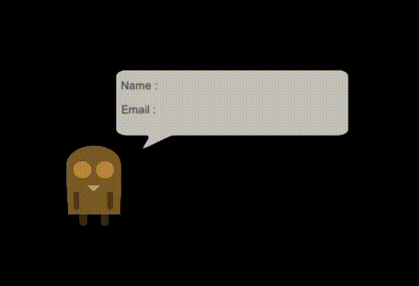

<h1> Convert Json Data from URL into C# Object Unity </h1>
<h2> 4210181010_Ilham Jalu Prakosa </h2>
<h3> Explaination About My Code : </h3>
<h3> to convert Json data into C# object i use a library called LitJson.  
  first, i made a class that which contains some variable that will be an object for Json data later. 
  then i use WWW to access url, after that i convert the json data to a C# object using LitJson function.  
  then i use "for" to do an iteration to find my data in json, because my last NIP Number is 10 so i will stop the iteration after i find the data that have id equals to 10.  
  then the last step is make a few UI Text in unity and make that UI Text show the Json Data.</h3>
<h3> Result : </h3>
;
